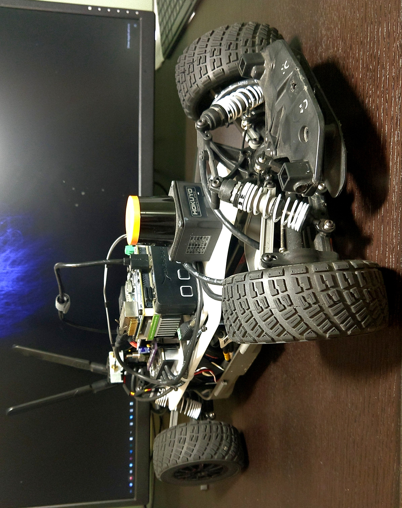

### Introduction

This is a pet project of mine that follows the [F1TENTH](https://f1tenth.org/) platform (minus the depth camera). If you can get hold of a Jetson and a Hokuyo, I highly recommend this project. I plan on putting my DOE and vehicle dynamics information online, but first I need to synthesize my results and write up. When this is complete, I will add a direct link to this page.  

